  

  
  
  

 

  

 

<h2 align="center"><samp>$ ls tech-stack/</samp></h2>

<samp>frontend/</samp>

  

<samp>backend/</samp>

  

<samp>tools-and-cloud/</samp>

  

Strongest with <b>Angular + TypeScript</b> — most of my repos live there. Lately shipping with <b>Next.js</b> and <b>Astro</b> too.

 

## <samp>$ git log --stat</samp>

  
  

  

  

  

 

## <samp>$ ping poethy</samp>

  
  

  

